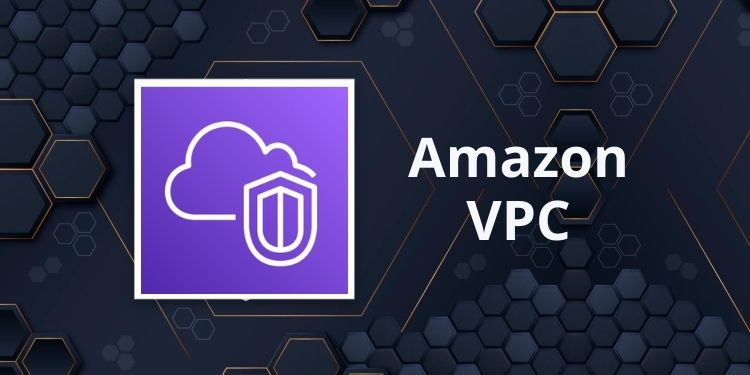

### VPC Vs EC2

**in this Quick demonstration we will talk about the differences between VPC and EC2 Services in the cloud**
## What is Amazon VPC (Virtual Private Cloud)? 

With Amazon Virtual Private Cloud (Amazon VPC), you can launch AWS resources in a ==logically isolated virtual network== that you've defined. This virtual network closely resembles a traditional network that you'd operate in your own data center, with the benefits of using the scalable infrastructure of AWS.

#### The following features help you configure a VPC to provide the connectivity that your applications need: 

Virtual private clouds (VPC)
: A VPC is a virtual network that closely resembles a traditional network that you'd operate in your own data center. After you create a VPC, you can add subnets.

Subnets
: A subnet is a range of IP addresses in your VPC. A subnet must reside in a single Availability Zone. After you add subnets, you can deploy AWS resources in your VPC.

IP addressing
: You can assign IP addresses, both IPv4 and IPv6, to your VPCs and subnets. You can also bring your public IPv4 addresses and IPv6 GUA addresses to AWS and allocate them to resources in your VPC, such as EC2 instances, NAT gateways, and Network Load Balancers.

Routing
 : Use route tables to determine where network traffic from your subnet or gateway is directed.

#### You can create and manage your VPCs using any of the following interfaces:
1. AWS Management Console 
1. AWS Command Line Interface (AWS CLI) 
1. AWS SDks
1. Query API

## What is Amazon EC2 (Elastic Compute Cloud)? 

 Amazon EC2 reduces hardware costs so you can develop and deploy applications faster. You can use Amazon EC2 to ==launch as many or as few virtual servers as you need==, configure security and networking, and manage storage. You can add capacity (scale up) to handle compute-heavy tasks, such as monthly or yearly processes, or spikes in website traffic. When usage decreases, you can reduce capacity (scale down) again.

 > Amazon EC2 reduces the time required to obtain and boot new server instances to minutes, allowing you to quickly scale capacity, both up and down, as your computing requirements change
 ___
## Use cases: 
#### 1. Run cloud-native and enterprise applications
Amazon EC2 delivers secure, reliable, high-performance, and cost-effective compute infrastructure to meet demanding business needs.
#### 2. Develop for Apple platforms
Build, test, and sign on-demand macOS workloads. Access environments in minutes, dynamically scale capacity as needed, and benefit from AWS’s pay-as-you-go pricing.
#### 3. Train and deploy ML applications
Amazon EC2 delivers the broadest choice of compute, networking (up to 400 Gbps), and storage services purpose-built to optimize price performance for ML projects.

### Key Differences : 
1. EC2 is a virtual server that you can run your software on. VPC is a virtual network that you use to connect your virtual servers, and other resources.
1. EC2 instances are virtual machines that live inside your virtual private cloud.
